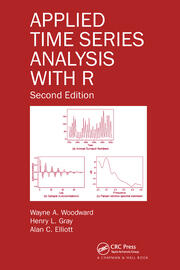

# Time Series Library in Python. Adapted from TSWGE in R 

This is a repository for the tswge library in python. 
It's been renamed Types for Time Series in Python. Originally tswge stood for Time Series Wayne A. Woodward, Henry L. Gray, and Alan C. Elliott. Normally Types would have been named Tipsy becaus it contains all the letters and is in the spirit of programming naming conventions. However since [approximately 10% of the US has an Alcohol Use Disorder](https://www.niaaa.nih.gov/alcohols-effects-health/alcohol-topics/alcohol-facts-and-statistics/alcohol-use-disorder-aud-united-states-age-groups-and-demographic-characteristics), the author feels it is more prudent to use a different name. The name wgTypes is still being considered. 

The translation of tswge is being done with permission from Bivin Sadler and Wayne Woodward. 

Tswge was written accompanying the text "Applied Time Series Analysis with R" by Wayne A. Woodward, Henry L. Gray, and Alan C. Elliott. 